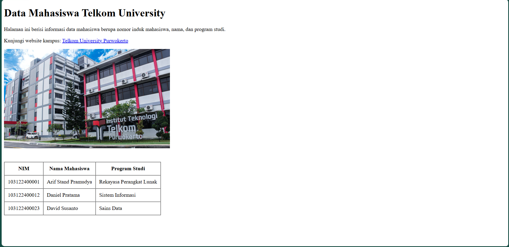
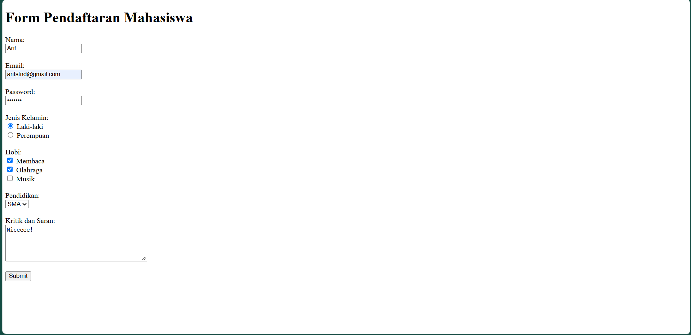

# Modul 02: HTML
**Nama:** Arif Stand Pramudya

**NIM:** 103122400001

**Kelas:** S1SE-08-02

## Soal 1

Buatlah sebuah halaman HTML sederhana dengan ketentuan berikut:
1. Memiliki judul halaman menggunakan heading.
2. Menampilkan satu paragraf singkat.
3. Menambahkan satu hyperlink menuju website lain.
4. Menampilkan satu gambar menggunakan elemen image.
5. Membuat tabel berisi minimal 3 baris data dan 3 kolom.

Tema: Data Mahasiswa.

Gunakan elemen HTML yang sesuai untuk heading, hyperlink, tabel, dan gambar.

## Soal 2

Buatlah sebuah form pendaftaran mahasiswa menggunakan HTML dengan komponen berikut:
1. Input Nama.
2. Input Email.
3. Input Password.
4. Pilihan Jenis Kelamin menggunakan radio button.
5. Pilihan Hobi menggunakan checkbox.
6. Pilihan Pendidikan menggunakan dropdown.
7. Kolom Kritik dan Saran menggunakan textarea.
8. Tombol Submit.

Gunakan elemen <label> pada setiap input agar form lebih mudah digunakan dan mendukung aksesibilitas dasar.

## Kode sumber

Tersedia di [soal1.html](soal1.html), dan [soal2.html](soal2.html)

## Output

* Soal 1:

* Soal 2:

## Deskripsi Program

Pada modul 2 `HTML` ini saya membuat dua halaman web sederhana menggunakan `HTML`, yang pertama digunakan untuk menampilkan data mahasiswa. Halaman ini berisi judul, paragraf informasi, `hyperlink` menuju website lain, gambar, serta tabel yang berisi data mahasiswa.

Halaman yang kedua digunakan untuk membuat form pendaftaran mahasiswa. Form ini berfungsi untuk menginput data mahasiswa seperti nama, email, password, jenis kelamin, hobi, pendidikan, serta kritik dan saran. Pada form ini menggunakan komponen yang berbeda seperti `input`, `radio button`, `chechbox`, `dropdown`, `textarea`, dan `button`.